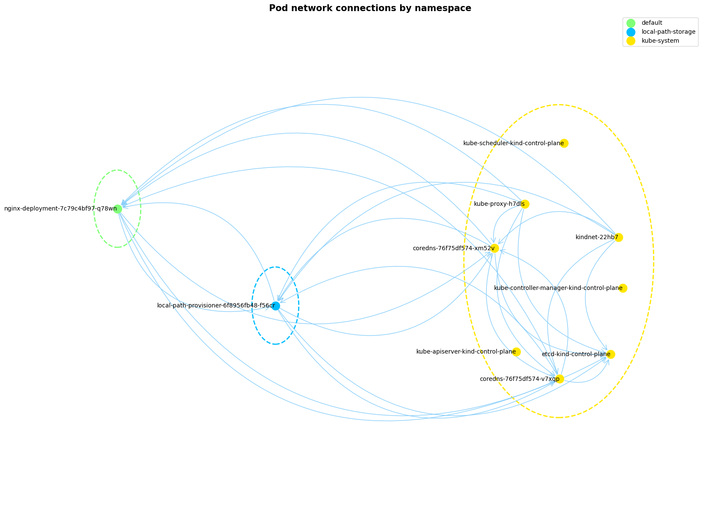

# Kube Map

Kube Map generates a network map of your Kubernetes cluster. It scans TCP 
connections on port 8042 between pods, then visualizes these connections in a 
graph. The example provided illustrates a simple kind cluster with no 
NetworkPolicies and a single nginx deployment running one pod.



**How It Works:**

Utilizing [ephemeral containers](https://kubernetes.io/docs/concepts/workloads/pods/ephemeral-containers/),
Kube Map injects an additional container into each pod. This mirrors the 
`kubectl debug example-pod --image=busybox -- ./binary` command. The inserted 
container conducts network checks before terminating. NetworkPolicies applicable 
to your pod also apply to this debug container, as pods are Kubernetes' smallest 
unit.

**Why Use Kube Map:**

As clusters grow in complexity, tracking NetworkPolicies becomes challenging. 
Variations in CNI plugin implementations may result in unexpected NetworkPolicy 
behaviors. Kube Map aids in threat modeling preparation, providing a clearer 
overview of cluster activities.

## How to Use Kube Map

```bash
# Apply the ServiceAccount for analysis
kubectl apply -f ./assets/access.yaml

# Export the ServiceAccount token and server host
export SERVER=$(kubectl config view -o jsonpath="{.clusters[?(@.name=='$(kubectl config current-context)')].cluster.server}")
export TOKEN=$(kubectl get secret ephemeral-token -o jsonpath='{.data.token}' | base64 -d)

# Install and execute Kube Map
poetry install
poetry run python cli.py
```

This process generates a `graph.png` in the working directory.

**Limitations:**

- Certain pods (e.g., kind pods in the example) cannot be patched, potentially
  skewing connection visibility.
- The app currently limits checks to port 8042 to avoid excessive file handler
  usage, likely omitting some permissible connections.
- Excessive permitted connections can clutter the graph, indicating a need for
  policy review.

## Developing kube map

Contributions via PRs, issues, and suggestions are welcome, with the expectation
of maintaining a respectful and constructive dialogue.

**Kube Map action overview:**

- Gather namespace information.
- Collect pod data by namespace.
- Attempt to patch each pod with `ghcr.io/busykoala/kubemap:main` as an
  additional ephemeral container (`./handler/Dockerfile`).
- Retrieve logs from the ephemeral containers.
- Analyze and visualize connections logged by these containers.

**Commands for local development:**

```bash
# Create a local cluster with a specific Kubernetes version
kind create cluster --image kindest/node:v1.29.0

# Build the handler image locally
docker build -t handler -f ./handler/Dockerfile ./handler
```
